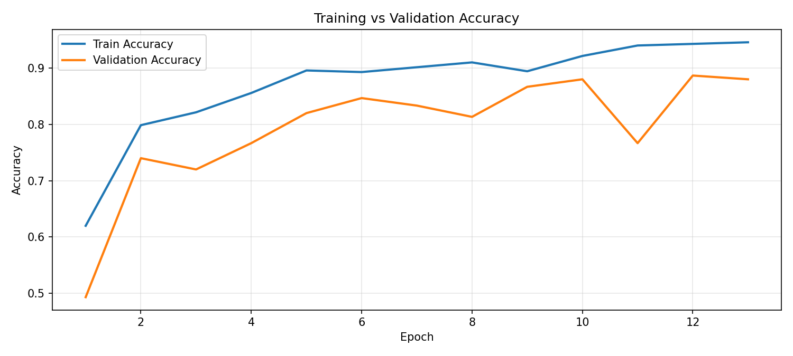
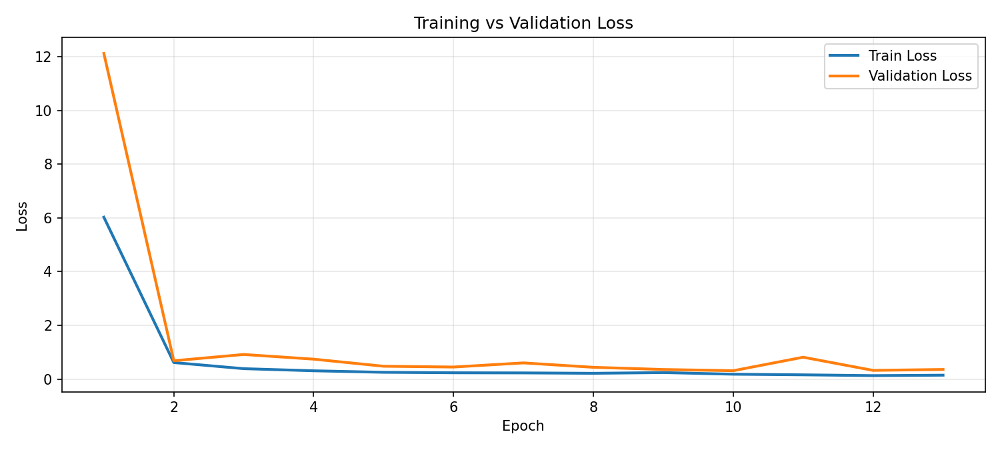
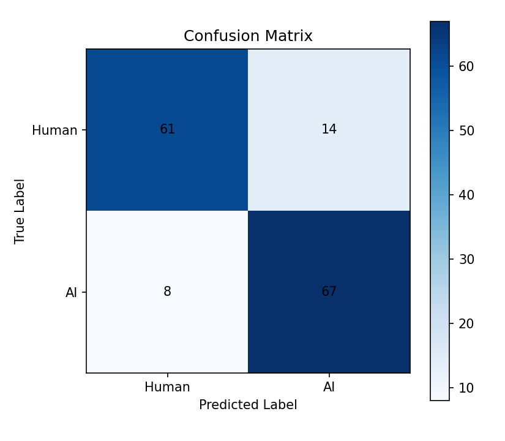
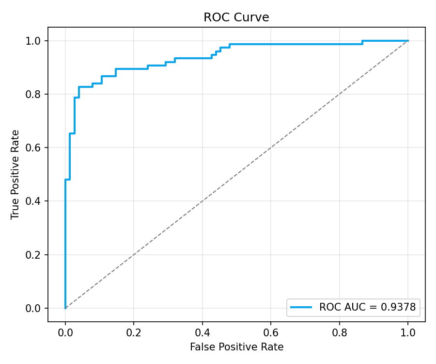

# AI Voice Detector


AI Voice Detector is a FastAPI-based audio classification project that predicts whether an uploaded voice clip is human or AI-generated. The system uses mel-spectrogram feature extraction, a trained CNN model, and a browser-based frontend for testing predictions directly from the app.

## Recognition

This project was developed as part of the AI Impact Summit Buildathon 2026 hosted by HCL GUVI. Our team secured a position among the Top 10 Grand Finale Finalists nationally out of 15,000+ participating teams across India, and were invited to present at Bharat Mandapam, New Delhi. The team represented Acube AI at the summit, engaging with enterprise leaders, founders, and potential clients at the startup pod.

## Key Features

- Binary voice classification: `HUMAN` vs. `AI_GENERATED`
- FastAPI backend with `POST /api/voice-detection`
- Browser UI served from `/` for quick manual testing
- Base64 audio upload support for MP3, WAV, and M4A files
- Mel-spectrogram preprocessing with `librosa`
- CNN inference using a saved Keras model at `saved_model/voice_ai_detector.h5`
- Training-time artifact generation for:
  - accuracy curve
  - loss curve
  - confusion matrix
  - ROC curve
  - classification metrics summary
- Confidence visualization in the frontend using Chart.js

## System Architecture

```mermaid
flowchart LR
  A[Audio file upload] --> B[Frontend converts audio to base64]
  B --> C[FastAPI endpoint /api/voice-detection]
  C --> D[Audio preprocessing in app/audio_utils.py]
  D --> E[Mel-spectrogram padded to 128 x 128 x 1]
  E --> F[Loaded CNN model in app/model_loader.py]
  F --> G[Sigmoid score]
  G --> H[Threshold at 0.5]
  H --> I[JSON response]
  I --> J[Frontend result cards + Chart.js graphs]
```



## Tech Stack

### Backend and ML
- FastAPI 0.110.0
- Uvicorn 0.29.0
- TensorFlow 2.15.0
- Keras
- NumPy 1.26.4
- scikit-learn 1.4.2
- librosa 0.10.1
- soundfile 0.12.1
- Pydantic 2.6.1
- matplotlib 3.8.4
- tqdm 4.66.2
- python-multipart 0.0.9

### Frontend
- HTML5
- CSS3
- Vanilla JavaScript
- Chart.js 4.4.3 via CDN
- Google Fonts (`Space Grotesk`, `IBM Plex Mono`)

### Tooling and Assets
- Python 3.10+
- Windows virtual environment setup in the repo notes
- Saved model artifact: `saved_model/voice_ai_detector.h5`

## Prerequisites

- Python 3.10 or newer
- A virtual environment
- Windows PowerShell or Command Prompt
- Audio dataset placed under:
  - `training/dataset/human/`
  - `training/dataset/ai/`

## Dataset & Privacy

The training dataset used for this project has been intentionally removed from this repository for privacy and security purposes. The dataset contained sensitive voice samples used to train the fraud detection model. If you wish to replicate this project, you will need to source or create your own dataset of genuine and synthetic/cloned voice samples.

## Installation

```powershell
py -3.10 -m venv venv
venv\Scripts\activate
python -m pip install --upgrade pip
pip install -r requirements.txt
```

## Training Workflow

1. Extract features from the dataset:

```powershell
python training/feature_extraction.py
```

2. Train the model and generate evaluation reports:

```powershell
python training/train_model.py
```

This creates:

- `training/X_features.npy`
- `training/y_labels.npy`
- `saved_model/voice_ai_detector.h5`
- `training/reports/accuracy_curve.png`
- `training/reports/loss_curve.png`
- `training/reports/confusion_matrix.png`
- `training/reports/roc_curve.png`
- `training/reports/metrics_summary.txt`

## Run Locally

Start the API and frontend:

```powershell
uvicorn app.main:app --reload
```

Open the UI in your browser:

- Frontend: `http://127.0.0.1:8000/`
- Swagger docs: `http://127.0.0.1:8000/docs`

To test the API from the command line:

```powershell
python test_api.py
```

## Demo screenshots

The frontend testing console (upload, status, and charts) — screenshots below were generated from the running app.

.png)

.png)

## Training Curves and Evaluation Plots

These plots are generated from the training pipeline in `training/train_model.py` and saved under `training/reports/`.

### Accuracy curve



### Loss curve



### Confusion matrix



### ROC curve



## API Endpoint

### `POST /api/voice-detection`

Requires the `x-api-key` header. The current key is defined in `app/config.py`.

### Request Body

```json
{
  "language": "Tamil",
  "audioFormat": "mp3",
  "audioBase64": "<base64-encoded audio>"
}
```

### Success Response

```json
{
  "status": "success",
  "language": "Tamil",
  "classification": "AI_GENERATED",
  "confidenceScore": 0.9978,
  "explanation": "Classification based on voice spectral patterns and prosody analysis"
}
```

### Error Response

```json
{
  "status": "error",
  "message": "<error message>"
}
```

## Folder Structure

```text
Ai-voice-detector/
├── app/
│   ├── audio_utils.py          # Audio decoding and mel-spectrogram preprocessing
│   ├── config.py               # Constants such as API key, model path, and audio settings
│   ├── main.py                 # FastAPI app, root UI route, and voice-detection endpoint
│   ├── model_loader.py         # Loads the trained Keras model and returns predictions
│   └── static/
│       ├── index.html          # Frontend UI
│       ├── styles.css          # UI styling
│       └── app.js              # Browser-side upload, request, and chart logic
├── saved_model/
│   └── voice_ai_detector.h5    # Trained CNN model
├── training/
│   ├── dataset/
│   │   ├── ai/
│   │   └── human/
│   ├── feature_extraction.py   # Converts raw audio into mel-spectrogram arrays
│   ├── train_model.py          # Trains the model and exports reports
│   ├── X_features.npy          # Extracted feature tensor
│   ├── y_labels.npy            # Binary labels
│   └── reports/                # Training charts and metrics output
├── encode_audio.py             # Helper script to base64-encode test audio
├── test_api.py                 # Command-line API test script
├── requirements.txt            # Python dependencies
└── README.md                   # Project documentation
```

## How It Works

1. `training/feature_extraction.py` loads each audio file from the human and AI dataset folders.
2. Each clip is resampled to 16 kHz, converted to a mel-spectrogram with 128 mel bands, transformed to dB scale, and padded or truncated to `128 x 128`.
3. The extracted dataset is saved as NumPy arrays in `training/X_features.npy` and `training/y_labels.npy`.
4. `training/train_model.py` splits the data into train, validation, and test sets using a 70/15/15 split.
5. A CNN is trained with three convolution blocks, batch normalization, max pooling, a dense layer, dropout, and a sigmoid output layer.
6. The best model is saved to `saved_model/voice_ai_detector.h5` with `ModelCheckpoint`.
7. During evaluation, the script writes training curves and reports into `training/reports/`.
8. At runtime, `app/main.py` loads the model and exposes the prediction endpoint.
9. `app/audio_utils.py` converts uploaded base64 audio into the same tensor shape expected by the CNN.
10. The frontend sends audio and API key to the backend, then displays the JSON response and confidence charts.

## Results and Performance

Metrics recorded in `training/reports/metrics_summary.txt`:

| Metric | Value |
| --- | ---: |
| Test Loss | 0.4251 |
| Test Accuracy | 0.8533 |
| ROC AUC | 0.9378 |
| Human Precision | 0.8841 |
| Human Recall | 0.8133 |
| Human F1-score | 0.8472 |
| AI Precision | 0.8272 |
| AI Recall | 0.8933 |
| AI F1-score | 0.8590 |
| Test Set Size | 150 samples |

